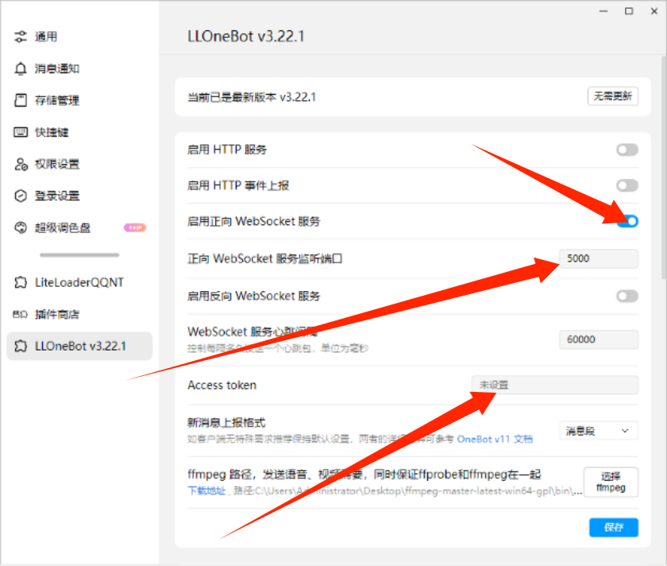

<div align="center">
  
# MorMor

# 基于[LLOneBot](https://github.com/LLOneBot/LLOneBot) 开发的.NET TerrariaServerBot

</div>

## 说明

- MomoAPI 基于[Sora](https://github.com/Hoshikawa-Kaguya/Sora)更改而来。
- MorMor 项目中数据库与分页工具部使用了[TShock](https://github.com/Pryaxis/TShock)代码
- 该机器人依然采用 tshock 的权限管理模式，使用 RABQ 模型，指令设计上不会与 tshock 有多少区别，另外也采用了插件加载模式，可以自写插件实现更多功能。

## 使用注意事项

- 如何部署 LLOneBot？请[点击此处](https://llonebot.github.io/zh-CN/guide/getting-started)查看教程!
- 使用前你可能需要配置 Mail 服务，机器人会用到，如发送注册密码等服务！
- TShock 管理功能需要插件，机器人用到的插件可在[TshockAdapter](https://github.com/dalaoshus/TShockAdapter)仓库下载使用
- LLOneBot 只需要打开 WebSocket 服务即可，注意端口号保持一致
  

# 预计支持功能(部分功能可能需要插件支持)

## 群功能

- [x] 群禁言
- [x] 群点歌(看框架是否支持)
- [x] 上下管理
- [x] wiki 查询
- [ ] reply(自定义回复)
- [x] 群签到
- [x] 查缩写
- [x] 设置群名
- [ ] 加群请求自定义处理

## 服务器管理

- [x] 执行服务器命令
- [x] 查看玩家背包
- [x] 查看服务器进度
- [x] 自动重置服务器
- [x] 查看服务器地图
- [x] 在线排行
- [x] 死亡排行
- [x] 用户注册管理
- [ ] 泰拉商店
- [ ] 泰拉奖池
- [x] 查询用户详细

## 其他功能

- [x] 服务器消息与群互相转发(需插件)

## 指令列表

| 名称            | 是否需要 TShock 插件 |               描述               |
| --------------- | :------------------: | :------------------------------: |
| /help           |          否          |           查看指令列表           |
| /签到           |          否          |             每日签到             |
| /reload         |          否          |             重读配置             |
| /group          |          否          |            权限组管理            |
| /account        |          否          |            账户组管理            |
| /星币           |          否          |             货币管理             |
| /scmdperm       |          否          |           查询指令权限           |
| /缩写           |          否          |           查询中文缩写           |
| /禁             |          否          |               禁言               |
| /解             |          否          |               解禁               |
| /生成地图       |          是          |      生成 Tshock 服务器地图      |
| /进度查询       |          是          |          查询服务器进度          |
| /user           |          否          |           注册用户管理           |
| /全禁           |          否          |             全体禁言             |
| /设置群名       |          否          |             设置群名             |
| /设置管理       |          否          |            设置管理员            |
| /取消管理       |          否          |            取消管理员            |
| /设置昵称       |          否          |          设置群成员昵称          |
| /切换           |          否          |         切换至某个服务器         |
| /在线           |          否          |        查询服务器在线玩家        |
| /注册           |          否          |          注册服务器用户          |
| /注册列表       |          否          |           查询注册列表           |
| /查背包         |          是          |        查询服务器玩家背包        |
| /在线排行       |          是          |          在线时长排行榜          |
| /死亡排行       |          是          |          死亡次数排行榜          |
| /启动           |          是          | 启动服务器(可附带 ts 的启动参数) |
| /泰拉服务器重置 |          是          |  重置服务器(可附带 ts 启动参数)  |
| /注册查询       |          否          |           查询注册账户           |
| /查             |          是          |           查询他人信息           |

## 配置文件

```json
{
	"指令前缀": [
		"/"
	],
	"权限所有者": 523321293,
	"监听地址": "127.0.0.1",
	"监听端口": 5000,
	"监听令牌": "", //LLoneBot 配置界面的 Access Token
	"数据库类型": "sqlite", //可选 sqlite 或 mysql 当为sqlite 为本地数据库无需配置相关 mysql
	"Sqlite 路径": "MorMor.sqlite",
	"数据库地址": "127.0.0.1",
	"数据库端口": 3306,
	"数据库名称": "", //数据库类型为 mysql 时必填
	"数据库用户名": "", //数据库类型为 mysql 时必填
	"数据库密码": "", //数据库类型为 mysql 时必填
	"用户默认权限组": "default",
	"邮箱服务地址": "",
	"发件人邮箱": "",
	"发件人邮箱密码": "",
	"Socket 服务器端口号": 6000, //Tshock 适配插件用的，端口需要保持一致
	"服务器列表": [{
		"服务器名称": "玄荒",
		"服务器 IP": "",
		"服务器端口号": 7777,
		"服务器转发端口号": 7777,
		"服务器 Rest 端口号": ,
		"服务器令牌": "", //TShock Rest API Token
		"注册默认组": "default",
		"货币兑换比例": 40000, //ec 套件货币兑换星币比例
		"是否开启商店": false,
		"是否开启抽奖": false,
		"Tshock 路径": "C:/Users/Administrator/Desktop/tshock/玄荒/", //tshock 路径
		"地图存放路径": "C:/Users/Administrator/Desktop/tshock/玄荒/world/玄荒.wld", //地图路径
		"服务器说明": "正常玩法服务器",
		"服务器版本": "1.4.4.9",
		"所属群": [
			114143,
			1576944,
		],
		"消息转发群": []
	}]
}
```
